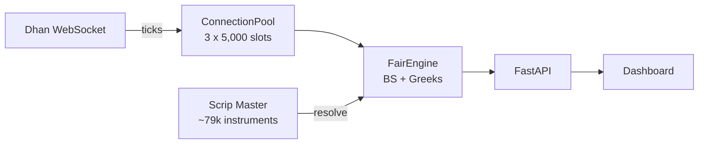

# F&O Fair Value Engine

Real-time F&O fair value calculator for Indian markets. Calculates theoretical prices using Black-Scholes and Cost of Carry models, detects mispricing, and surfaces trading signals via a live dashboard.

## Architecture



See [docs/architecture.md](docs/architecture.md) for full diagrams.

## Quick Start

```bash
# Install
python -m venv .venv && source .venv/bin/activate
pip install -r requirements.txt

# Configure
echo "DHAN_CLIENT_ID=your_id" > .env
echo "DHAN_ACCESS_TOKEN=your_token" >> .env

# Run
python -m src.main
```

Dashboard at `http://localhost:8000` | API docs at `http://localhost:8000/docs`

## Docker

```bash
docker compose up --build
```

## Fair Value Models

**Options (CE/PE)** — Black-Scholes with Newton-Raphson IV solver + enhanced Greeks (vanna, volga, charm, speed, color, zomma)

**Futures** — Cost of Carry: `F = S * e^((r-d)*T)`

**Mispricing** = Market Price - Theoretical Price

| Signal | Condition | Action |
|--------|-----------|--------|
| OVERVALUED | mis% > +1% | SHORT candidate |
| UNDERVALUED | mis% < -1% | LONG candidate |
| FAIR | \|mis%\| < 1% | No action |

## Key Features

- **15,000 instrument slots** across 3 WebSocket connections with tiered subscription management
- **Enhanced Greeks** — vanna, volga, charm, speed, color, zomma
- **Market structure metrics** — IV rank, IV percentile, moneyness, put-call parity deviation, basis, skew
- **Auto-resolution** — provide symbol + expiry + strike + type, system resolves all IDs from Dhan scrip master
- **ATM rotation** — Tier 2 stocks auto-rotate subscriptions as spot price moves
- **Fuzzy search** — search across ~79,000 instruments with rapidfuzz
- **Cross-exchange detection** — NSE/BSE cross-listed instruments tagged with spread metric
- **Interactive dashboard** — tabbed UI with signals, chain view, search, tier config

## API

| Method | Path | Description |
|--------|------|-------------|
| GET | `/api/fair` | All results sorted by signal strength |
| GET | `/api/fair/signals?min_pct=1.0` | Mispriced contracts only |
| POST | `/api/contracts/add` | Add contract `{symbol, expiry, strike, contract_type}` |
| GET | `/api/search?q=NIFTY` | Fuzzy search instruments |
| GET | `/api/tiers` | Tier configuration |
| WS | `/ws/fair` | Live FairResult stream |

Full endpoint list in [docs/usage.md](docs/usage.md).

## Project Structure

```
src/
├── main.py                  # CLI entrypoint
├── server.py                # FastAPI app + lifespan
├── config.py                # Settings from .env
├── core/
│   ├── models.py            # ContractMeta, Tick, FairResult
│   └── fair_engine.py       # BS, CoC, Greeks, engine class
├── feed/
│   ├── dhan_feed.py         # Dhan SDK wrapper
│   └── connection_pool.py   # Multi-connection manager
├── subscription/
│   ├── slot_tracker.py      # Capacity tracking
│   ├── tier_config.py       # Tier persistence
│   └── rotation_manager.py  # ATM rotation
├── scrip/
│   └── scrip_master.py      # CSV resolver + cross-listing
├── search/
│   └── fuzzy_index.py       # rapidfuzz search
└── api/
    ├── schemas.py            # Pydantic models
    └── routes/               # FastAPI routers
```

## Testing

```bash
.venv/bin/python -m pytest tests/ -v
```
