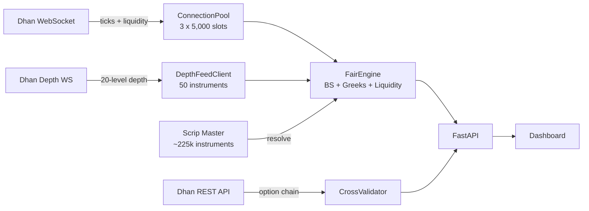

# F&O Fair Value Engine

Real-time F&O fair value calculator for Indian markets. Calculates theoretical prices using Black-Scholes and Cost of Carry models, detects mispricing, and surfaces trading signals via a live dashboard.

## Architecture



See [docs/architecture.md](docs/architecture.md) for full diagrams.

## Quick Start

```bash
# Install
python -m venv .venv && source .venv/bin/activate
pip install -r requirements.txt

# Configure
cp .env.example .env
# Edit .env with your Dhan credentials

# Run
python -m src.main
```

Dashboard at `http://localhost:8000` | API docs at `http://localhost:8000/docs`

## Docker

```bash
docker compose up --build
```

## What Happens on Startup

1. Loads NSE holiday calendar (fetched from NSE API, cached to disk)
2. Downloads Dhan scrip master CSV (~225k instruments, cached 24h)
3. Builds fuzzy search index over all F&O instruments
4. Opens 3 WebSocket connections (15,000 instrument slots total) + 1 depth connection (50 instruments)
5. Subscribes Tier 1 index chains (NIFTY, BANKNIFTY, FINNIFTY, MIDCPNIFTY, SENSEX, BANKEX) + their underlyings
6. Starts receiving live ticks with liquidity fields; depth feed auto-rotates to top 50 signal contracts every 30s
7. After market close (15:30 IST), feeds sleep gracefully until next session; dashboard shows MARKET CLOSED

## Fair Value Models

**Options (CE/PE)** -- Black-Scholes with Newton-Raphson IV solver + enhanced Greeks (vanna, volga, charm, speed, color, zomma)

**Futures** -- Cost of Carry: `F = S * e^((r-d)*T)`

**Mispricing** = Market Price - Theoretical Price (clamped to +/-500%)

| Signal | Condition | Action |
|--------|-----------|--------|
| OVERVALUED | mis% > +1% | SHORT candidate |
| UNDERVALUED | mis% < -1% | LONG candidate |
| FAIR | \|mis%\| < 1% | No action |

## Key Features

- **15,000 instrument slots** across 3 WebSocket connections with tiered subscription management
- **Enhanced Greeks** -- vanna, volga, charm, speed, color, zomma
- **Market structure metrics** -- IV rank, IV percentile, moneyness, put-call parity deviation, basis, skew
- **Liquidity metrics** -- volume, OI, bid/ask spread, buy/sell qty, composite liquidity score (0–100), low_liquidity flag
- **20-level market depth** -- depth_bids, depth_asks, total depth, bid/ask imbalance (-1 to +1) via dedicated depth WebSocket connection (auto-rotates to top 50 signal contracts every 30s)
- **Option chain cross-validation** -- compares engine-computed Greeks and IV against Dhan option chain API values; OK/WARN/ALERT deviation report per field
- **Market hours awareness** -- NSE holiday calendar (9:15–15:30 IST); feeds sleep gracefully after close instead of reconnect-looping; dashboard shows MARKET CLOSED indicator with countdown
- **Auto-resolution** -- provide symbol + expiry + strike + type, system resolves all IDs from Dhan scrip master
- **Underlying auto-subscription** -- when subscribing derivatives, the underlying index/equity is automatically subscribed too
- **ATM rotation** -- Tier 2 stocks auto-rotate subscriptions as spot price moves
- **Fuzzy search** -- search across all F&O instruments with rapidfuzz
- **Cross-exchange detection** -- NSE/BSE cross-listed instruments tagged with spread metric
- **Thread safety** -- all shared state protected by locks, atomic index swaps, safe async broadcast
- **Interactive dashboard** -- tabbed UI with signals, chain view, search, tier config

## Tier System

| Tier | Description | Rotation |
|------|-------------|----------|
| 1 | Index full chains (NIFTY, BANKNIFTY, etc.) | None -- always subscribed |
| 2 | ATM-centric stocks | Auto-rotates as spot moves |
| 3 | Manual one-offs via dashboard/API | None |

Configure via dashboard Tier Config panel or `POST /api/tiers`.

## API

| Method | Path | Description |
|--------|------|-------------|
| GET | `/api/fair` | All results sorted by signal strength |
| GET | `/api/fair/signals?min_pct=1.0` | Mispriced contracts only |
| POST | `/api/contracts/add` | Add contract `{symbol, expiry, strike, contract_type}` |
| GET | `/api/search?q=NIFTY` | Fuzzy search instruments |
| GET | `/api/tiers` | Tier configuration |
| GET | `/api/slots` | Slot usage breakdown |
| GET | `/api/optionchain?symbol=NIFTY&expiry=2026-04-24` | Dhan option chain with engine values side-by-side |
| GET | `/api/optionchain/validate?symbol=NIFTY&expiry=2026-04-24` | Greeks/IV cross-validation report |
| GET | `/api/market-status` | LIVE / PRE_OPEN / CLOSED with countdown |
| WS | `/ws/fair` | Live FairResult stream |

Full endpoint list in [docs/usage.md](docs/usage.md).

## Project Structure

```
src/
├── main.py                  # CLI entrypoint
├── server.py                # FastAPI app + lifespan
├── config.py                # Settings from .env
├── core/
│   ├── models.py            # ContractMeta, Tick, FairResult
│   ├── fair_engine.py       # BS, CoC, Greeks, liquidity, depth engine
│   └── cross_validator.py   # Greeks/IV deviation vs Dhan option chain
├── feed/
│   ├── dhan_feed.py         # Dhan SDK wrapper (DhanFeed)
│   ├── connection_pool.py   # Multi-connection manager
│   └── depth_feed.py        # 20-level depth WebSocket client
├── subscription/
│   ├── slot_tracker.py      # Capacity tracking
│   ├── tier_config.py       # Tier persistence (JSON)
│   └── rotation_manager.py  # ATM rotation
├── scrip/
│   └── scrip_master.py      # CSV resolver + cross-listing
├── search/
│   └── fuzzy_index.py       # rapidfuzz search
├── utils/
│   └── market_hours.py      # NSE hours, holiday calendar, sleep helpers
└── api/
    ├── schemas.py            # Pydantic models
    └── routes/               # FastAPI routers (incl. optionchain.py)
```

## Testing

```bash
.venv/bin/python -m pytest tests/ -v
# 105 tests covering math, scrip resolution, feed, subscriptions, API routes,
# liquidity scoring, depth feed, option chain, cross-validation, market hours
```
