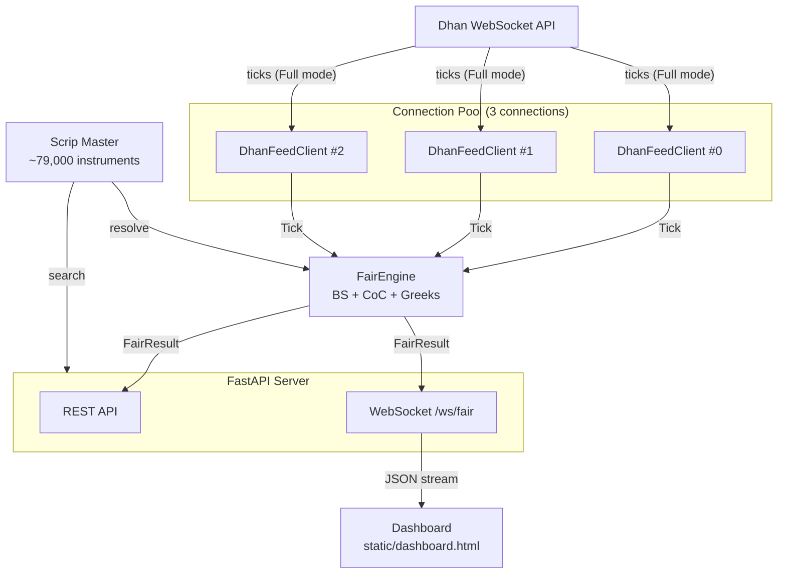
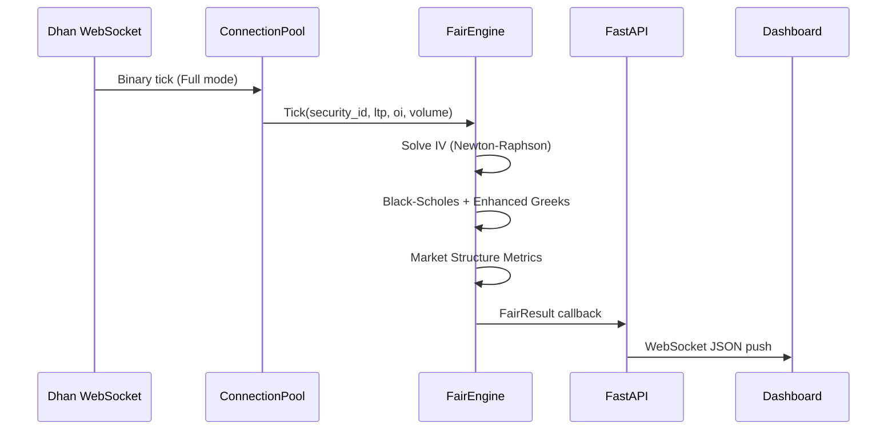
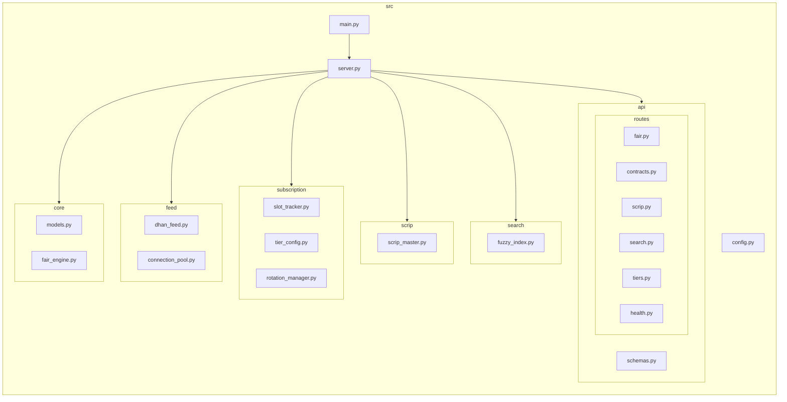
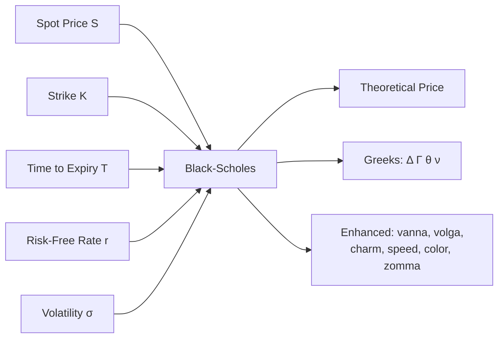
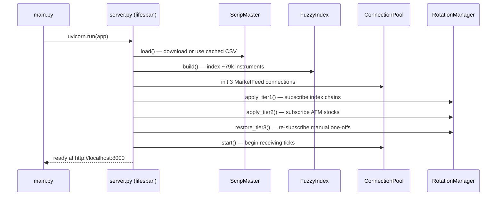

# Architecture

## System Overview

## Data Flow

## Package Structure

## Component Responsibilities

### Core

| Module | Responsibility |
|--------|---------------|
| `models.py` | Data classes: `ContractType`, `ContractMeta`, `Tick`, `FairResult` |
| `fair_engine.py` | Black-Scholes pricing, Cost of Carry, IV solver, enhanced Greeks (vanna, volga, charm, speed, color, zomma), market metrics (IV rank, moneyness, put-call parity, basis, skew), thread-safe engine with pair index |

### Feed

| Module | Responsibility |
|--------|---------------|
| `dhan_feed.py` | Wraps one `dhanhq.MarketFeed` SDK connection. Converts tick callbacks to `Tick` objects. |
| `connection_pool.py` | Manages 3 feed connections. Routes subscribe/unsubscribe to least-loaded connection. |

### Subscription

| Module | Responsibility |
|--------|---------------|
| `slot_tracker.py` | Tracks used/available instrument slots per tier. Capacity forecasting. |
| `tier_config.py` | Persists tier settings (index chains, ATM stocks, manual one-offs) to JSON. |
| `rotation_manager.py` | Watches spot prices. Rotates Tier 2 subscriptions to keep ATM window active. Marks out-of-range strikes as stale with TTL eviction. |

### Scrip & Search

| Module | Responsibility |
|--------|---------------|
| `scrip_master.py` | Downloads Dhan scrip master CSV, caches locally, builds lookup index. Resolves `(symbol, expiry, strike, type)` to full `ContractMeta`. Detects cross-listed instruments via ISIN. Daily refresh at 08:45 IST. |
| `fuzzy_index.py` | In-memory fuzzy search over ~79,000 instruments using `rapidfuzz`. |

## Pricing Models

### Options — Black-Scholes

**Formulas:**
- `d1 = [ln(S/K) + (r + sigma^2/2)*T] / (sigma * sqrt(T))`
- `d2 = d1 - sigma * sqrt(T)`
- Call: `S*N(d1) - K*e^(-rT)*N(d2)`
- Put: `K*e^(-rT)*N(-d2) - S*N(-d1)`
- IV solved via Newton-Raphson (100 iterations, tol=1e-6)

### Futures — Cost of Carry

`F = S * e^((r - d) * T)` where `d` = dividend yield (default 0)

### Signal Logic

## Capacity Planning

| Resource | Value |
|----------|-------|
| Dhan max connections/user | 5 |
| Reserved for other services | 2 |
| Available to this engine | 3 |
| Instruments per connection | 5,000 |
| **Total slots** | **15,000** |
| F&O universe (scrip master) | ~79,000 |
| Coverage | ~19% |

## Startup Sequence

