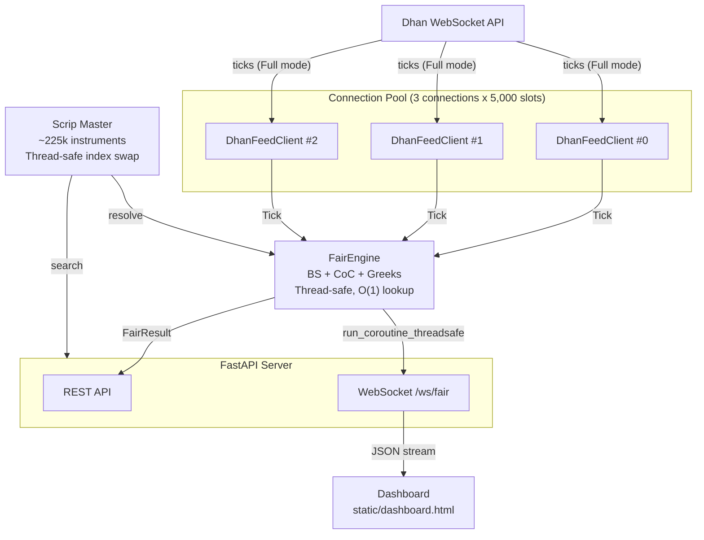
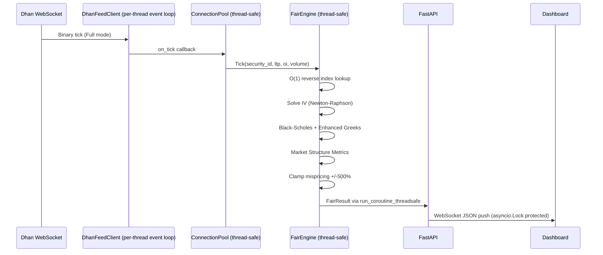
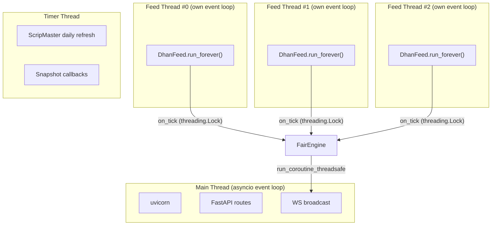
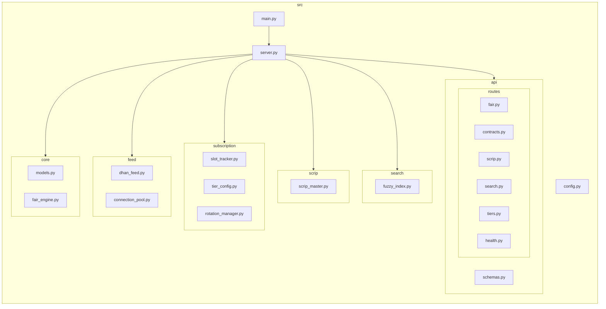
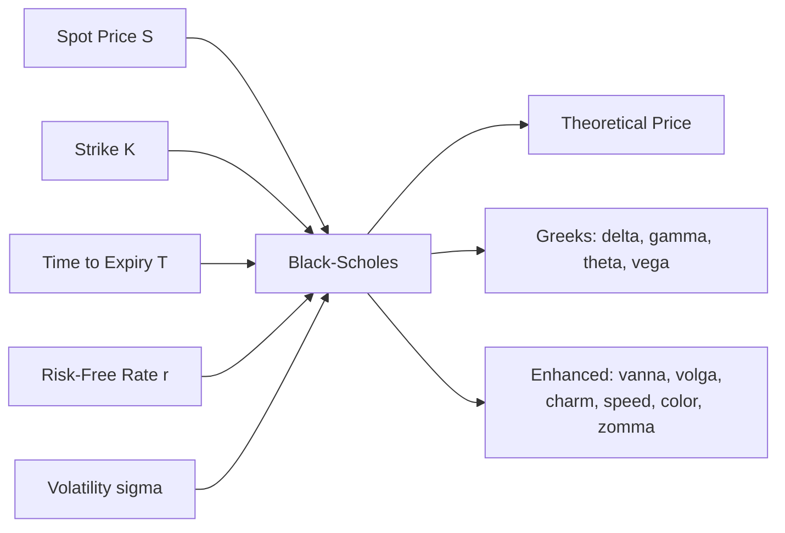
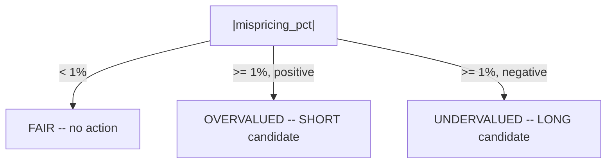
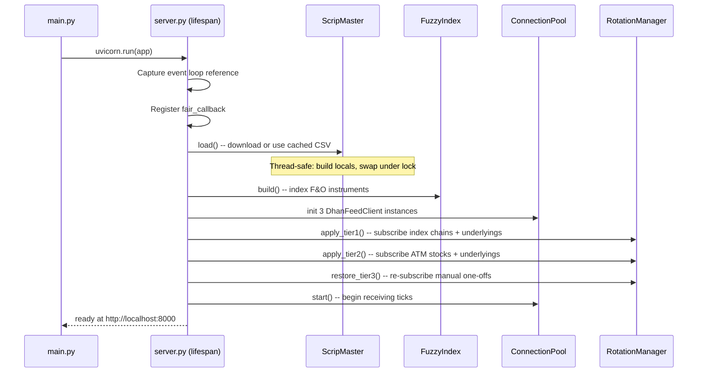

# Architecture

## System Overview

## Data Flow

## Thread Model

## Package Structure

## Component Responsibilities

### Core

| Module | Responsibility |
|--------|---------------|
| `models.py` | Data classes: `ContractType`, `ContractMeta`, `Tick`, `FairResult`. IST timestamps. Idempotent `__post_init__`. |
| `fair_engine.py` | Black-Scholes pricing, Cost of Carry, IV solver, enhanced Greeks (vanna, volga, charm, speed, color, zomma), market metrics (IV rank, moneyness, put-call parity, basis, skew). Thread-safe engine with O(1) reverse index for underlying lookup. Snapshot callbacks. Mispricing clamped +/-500%. Expired contracts skipped. |

### Feed

| Module | Responsibility |
|--------|---------------|
| `dhan_feed.py` | Wraps one `dhanhq.DhanFeed` SDK connection. Per-thread event loop (cleaned up on disconnect). Thread-safe subscribe/unsubscribe returning bool. Auto-reconnect with 5s delay. |
| `connection_pool.py` | Manages 3 feed connections. Thread-safe least-loaded assignment. Checks subscribe return value. Propagates `max_instruments` config. |

### Subscription

| Module | Responsibility |
|--------|---------------|
| `slot_tracker.py` | Thread-safe slot tracking with atomic reads (single lock in `forecast`/`to_dict`). `contains()` public method. Per-tier breakdown. |
| `tier_config.py` | Thread-safe JSON config. Atomic file writes (temp + rename). `update()` for batch mutations. Separate `tier1_expiry_count` and `tier2_expiry_count`. |
| `rotation_manager.py` | Subscribes underlyings automatically in tier1/tier2. Tier 1 protected from rotation/stale eviction. ATM rotation for Tier 2 using public engine/scrip_master methods. |

### Scrip & Search

| Module | Responsibility |
|--------|---------------|
| `scrip_master.py` | Downloads Dhan scrip master CSV. Thread-safe index rebuild (build into locals, swap under lock). Explicit `FUTURES_INST_TYPES` set. Strike rounding to 2dp. NaN guards. NSE-preferred underlying map. Cross-listing via ISIN. Daily refresh at 08:45 IST. Atomic downloads. |
| `fuzzy_index.py` | In-memory fuzzy search using `rapidfuzz`. |

## Pricing Models

### Options -- Black-Scholes

**Formulas:**
- `d1 = [ln(S/K) + (r + sigma^2/2)*T] / (sigma * sqrt(T))`
- `d2 = d1 - sigma * sqrt(T)`
- Call: `S*N(d1) - K*e^(-rT)*N(d2)`
- Put: `K*e^(-rT)*N(-d2) - S*N(-d1)`
- IV solved via Newton-Raphson (100 iterations, tol=1e-6)
- Degenerate inputs (S<=0, K<=0, T<=0, sigma<=0) return None

### Futures -- Cost of Carry

`F = S * e^((r - d) * T)` where `d` = dividend yield (default 0)

### Signal Logic

Mispricing % clamped to +/-500%. Options with fair value < 1.0 get mispricing_pct = 0 (avoids spurious signals on near-worthless options).

## Capacity Planning

| Resource | Value |
|----------|-------|
| Dhan max connections/user | 5 |
| Reserved for other services | 2 |
| Available to this engine | 3 |
| Instruments per connection | 5,000 |
| **Total slots** | **15,000** |
| F&O universe (scrip master) | ~225,000 |

## Startup Sequence

## Thread Safety Summary

| Component | Protection | Pattern |
|-----------|-----------|---------|
| FairEngine | `threading.Lock` | Lock on all state mutations and reads |
| ScripMaster | `threading.Lock` | Build into locals, atomic swap under lock |
| DhanFeedClient | `threading.Lock` | Protects `_subscribed` and `_feed` |
| ConnectionPool | `threading.Lock` | Protects `_assignment` |
| SlotTracker | `threading.Lock` | Single-lock atomic reads in forecast/to_dict |
| TierConfig | `threading.Lock` | Batch `update()`, atomic file write |
| ws_clients | `asyncio.Lock` | Set with discard, snapshot before broadcast |
| fair_callback | `run_coroutine_threadsafe` | Thread-safe async dispatch |
